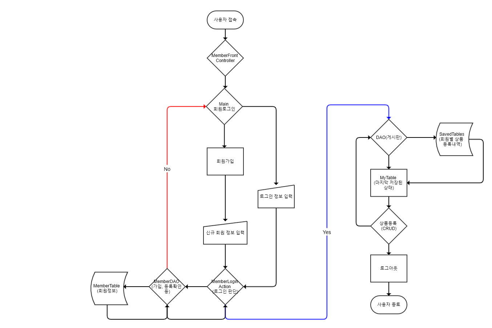

# MyCart
## 서비스 개요
MyCart 는 한정판 프리미엄 패션물품 판매 서비스인 [StockX](https://stockx.com/) 에서 착안한 소비자 맞춤형 장바구니 서비스입니다.

## 기획배경
  - 상품정보를 사용자 정의 검색 조건 및 포트폴리오 제목과 같이 저장할 수 있는 기능 제공 
  - &rarr; 저장된 정보를 StockX 서비스에 내재화가 가능하다면 보다 사용자 친화적인 방향의 웹사이트가 될 것이라는 의견에서 발전

## 개발환경
* 운영환경
  - Apache Tomcat 9.0
* 사용기술
  - JAVA8, servlet, model2, HTML5, CSS3, Javascript, jQuery, JDBC(Oracle)
* IDE
  - Eclipse
  
## 개발기간: 10일
* ~12/1(일) : 사전준비 (Meeting 폴더 참조)
  - 주제 선정: 11/28 의견 수렴 후 결정
  - gitHub 강의 수료
  - 업무분담 계획 조율
* 12/3(화)~12/5(목) : 로그인 모듈 구현
* 12/6(금) : 1차 점검
  - 진행현황 점검 및 향후 업무계획 논의
* 12/10(화) ~ 12/11(수): MyCart 모듈 작업
* 12/12(목) : 모듈통합
* 12/13(금) : 시연 및 제출

## 설계 및 기능 소개
<순서도>

## 기여한 부분
  - 회원 관리와 관련된 로그인, 회원가입 자바 모듈(src/user.member) 
    JDBC를 위한 DAO, DTO 구성(src/user.db)
    
  - 로그인 모듈에 암복호화 기능 추가(비대칭키 방식 중 대표적인 RSA 방식을 활용)
    <Process>
    1. index.jsp를 거친 후 controller에서 PublicKey와 PrivateKey를 생성한다. 이때 개인키는 session에 저장한다. 
       (UserMemberEncryptAction.java의 코드 참조. Java의 security 라이브러리 활용.)
    2. PublicKey를 사용하여 modulus와 exponent를 생성하고 request에 담는다.
    3. 위와 같이 암호화를 위한 준비를 마친 후 login.jsp를 호출한다.
    4. 클라이언트단에서 입력받은 정보들을 modulus, exponent로 RSA 암호화 하여 다시 서버로 전송한다. 
       (login.jsp의 Javascript코드 참조. hidden form으로 이중폼 구성. 74-110번째 line)
    5. 최종적으로 전송받은 암호화 코드는 session에 저장해둔 PrivateKey로 복호화하여 로그인을 진행한다. 
       (UserMemberDecryptAction.java의 코드 참조.)
  
  - Javascript를 이용해 정규표현식으로 회원가입과 로그인 프로세스에 유효성 검사 기능 추가
    (login.jsp의 Javascript코드 참조. 155-223번째 line)

## 향후 개선방안
- CSRF attack, Session Hijacking, XSS과 같은 보안 측면의 취약점을 고려하여 기능 보강
- StringTokenization 활용한 포트폴리오 및 검색조건란 연계 검색 알고리즘 구축
- 저장한 상품정보에 대한 시각화 정보 제공 (HighChart, d3 등)
